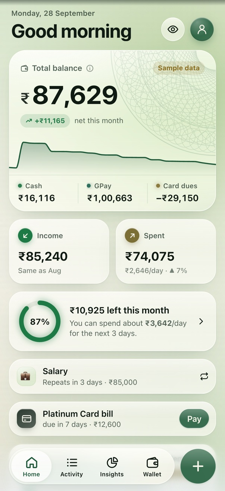
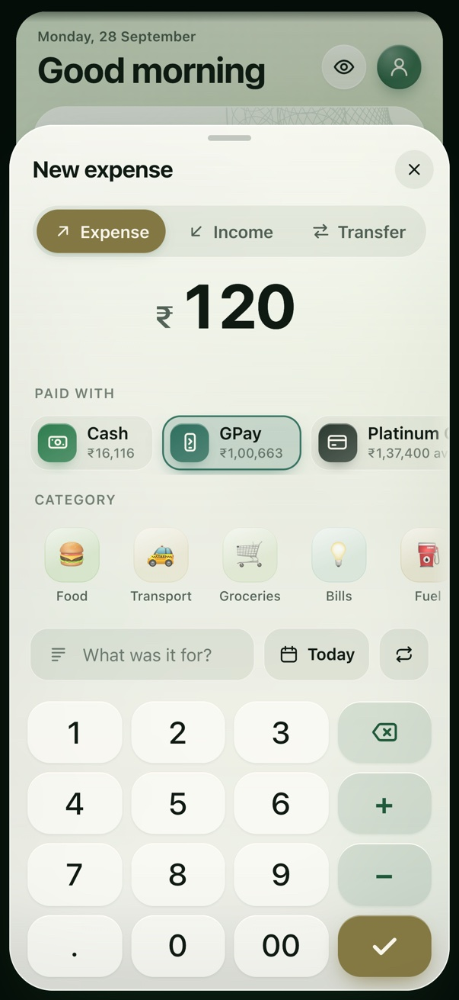
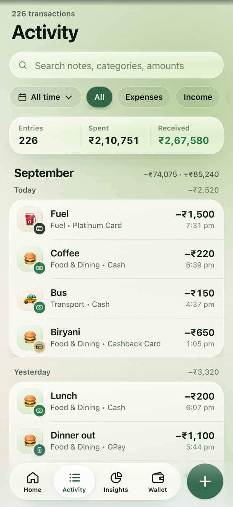
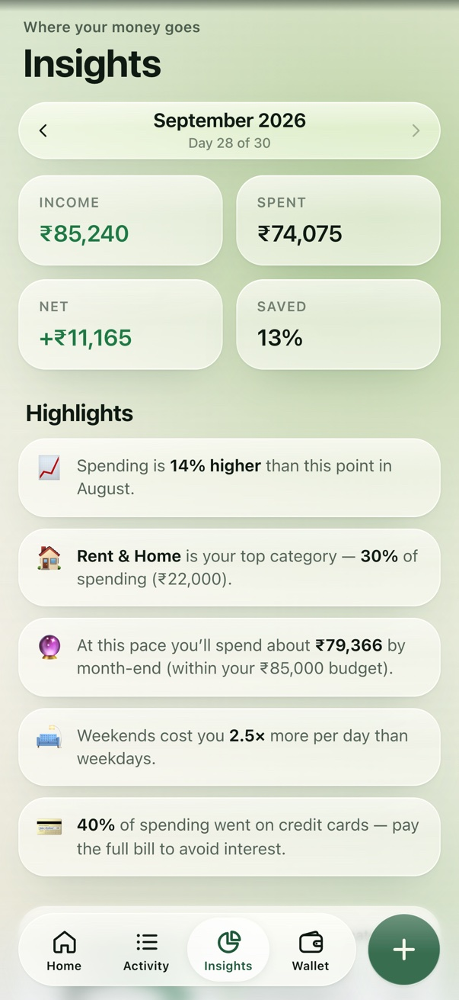
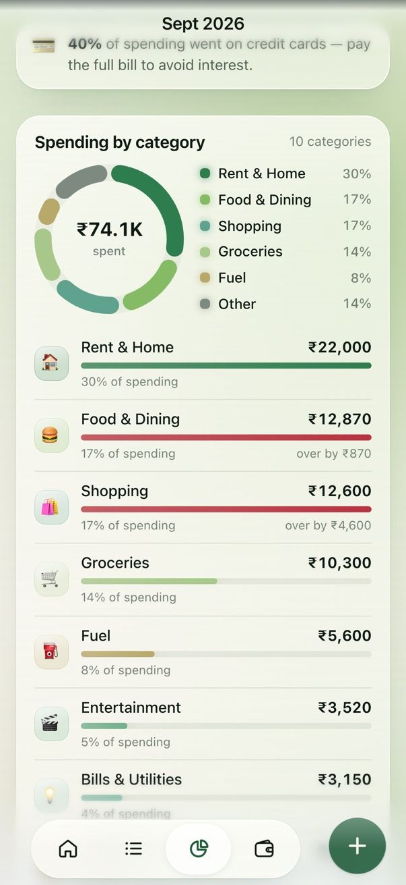
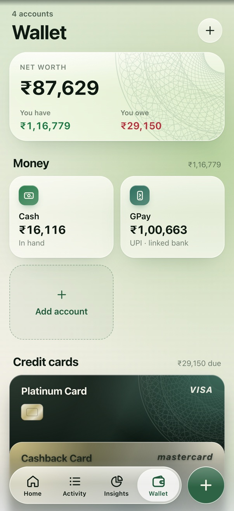
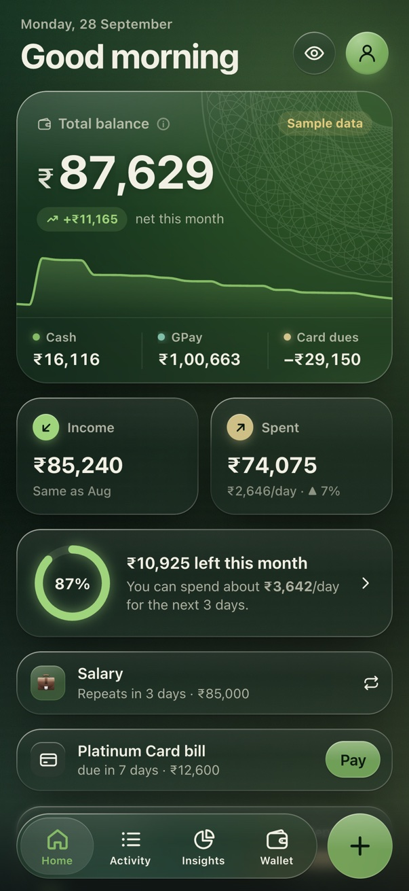
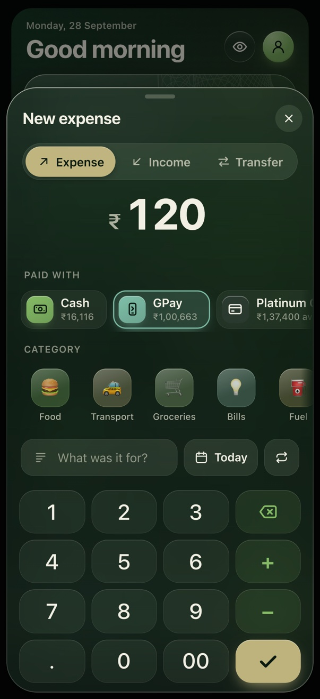
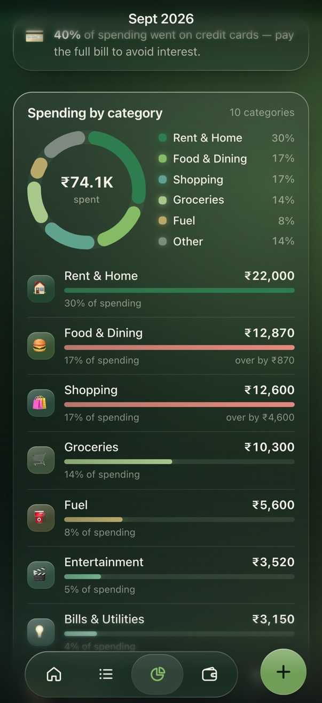
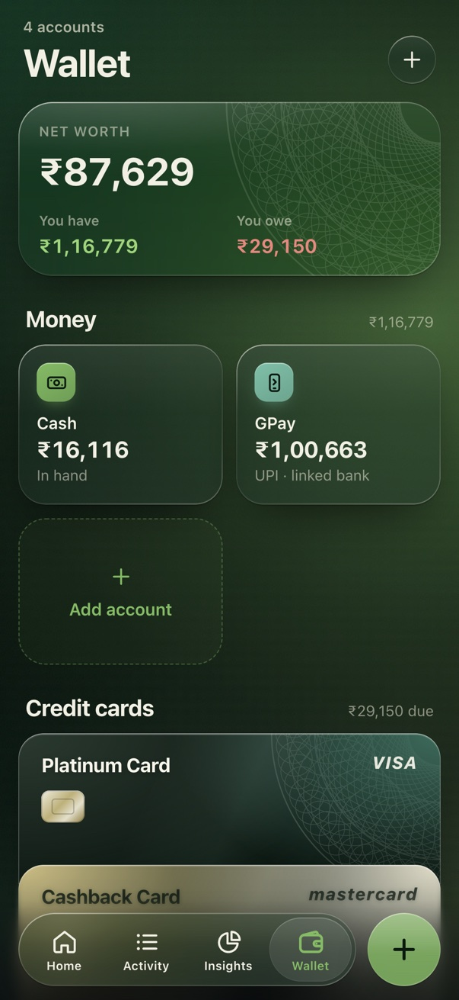

# Watch Your Benjamins

A tiny, private, offline expense tracker with an iOS 26–style **Liquid Glass** interface, in the colours of the US dollar.
You can track income and spending across **Cash, GPay/UPI and credit cards**, and your
balance stays correct: card bills never double-count your spending.

| | |
|---|---|
| **Android** | `releases/Benjamins-v1.0.0.apk`. It's about 150 KB and needs **no permissions** (not even internet). |
| **iPhone** | Install it from Safari as a home-screen web app. The `ios/` Xcode project also runs it natively on your own phone. |
| **Data** | Stays on the phone only (IndexedDB plus a localStorage cache). Back up to a JSON file whenever you like. |

---

## Screenshots

<table>
  <tr>
    <td align="center" width="33%"></td>
    <td align="center" width="33%"></td>
    <td align="center" width="33%"></td>
  </tr>
  <tr>
    <td valign="top"><b>Home.</b> Your total balance is Cash + GPay − what you owe on cards. Below it: this month's income and spending, how much of the budget is left per day, upcoming recurring payments and card bills with a one-tap <i>Pay</i>.</td>
    <td valign="top"><b>Add.</b> Tap <b>+</b>, type the amount on the calculator keypad (sums like <code>120+45</code> work), pick how you paid and a category, then tick. Your most-used categories come first.</td>
    <td valign="top"><b>Activity.</b> Every transaction, grouped by day with daily totals. Search by note, category or amount, and filter by expenses, income or transfers. Tap a row to edit it, or swipe it to delete.</td>
  </tr>
  <tr>
    <td align="center"></td>
    <td align="center"></td>
    <td align="center"></td>
  </tr>
  <tr>
    <td valign="top"><b>Insights.</b> The month at a glance (income, spent, net, % saved) and plain-English highlights, like "Weekends cost you 2.5× more per day".</td>
    <td valign="top"><b>Spending by category.</b> A donut chart plus a bar for each category. Bars turn red when you go over that category's budget.</td>
    <td valign="top"><b>Wallet.</b> Net worth split into what you have and what you owe. Cash and UPI accounts sit on top, and your credit cards are stacked like Apple Wallet. Tap any of them to see its ledger.</td>
  </tr>
</table>

**Dark mode ("black ink").** The theme follows your phone, or you can pick one in Settings.

<p>
  
  
  
  
</p>

The screenshots show the built-in sample data. To try it yourself, choose **Explore with sample data** on the first screen, then clear it any time in *Settings → Start fresh*.

---

## Features

- **Balance that behaves like real money:** Cash + GPay/bank − credit-card dues.
  - A card spend lowers your balance immediately.
  - Paying the card bill is a *transfer*, so it isn't counted as spending twice.
  - ATM withdrawals and cash deposits are transfers too.
- **Two-tap logging:**
  - A calculator keypad (`120+45−10`) with categories sorted by how often you use them.
  - Quick-add chips for things you log often.
  - Undo on every add and delete.
- **Quick buttons:** one tap on Home logs a preset, with Undo.
  - Defaults: ⛽ Petrol ₹500 on your card, 📱 Vodafone recharge ₹666 on GPay, 🎵 Apple Music ₹129 on card, Chai ₹30 cash, Lunch ₹150 GPay and Auto ₹60 cash.
  - Add, edit, reorder or delete them from *Edit*, or long-press a button. Any transaction type can be a button, including transfers such as an ATM withdrawal.
  - The manager also suggests buttons from your most frequent spends.
- **Payment methods:** Cash, one or more UPI wallets or bank accounts, and any number of credit cards. Each card has a limit, a due date and a utilisation bar.
- **Insights:**
  - A category donut and per-category budgets.
  - The split between Cash, GPay and cards.
  - A daily spending chart and a 6-month trend.
  - Plain-English highlights, e.g. "Weekends cost you 1.8× more…".
- **Budgets:** a monthly ring on Home that shows a *safe-to-spend per day* figure.
- **Recurring payments:** rent, salary and subscriptions get logged automatically every month.
- **Wallet:** Apple-Wallet-style card stack. Each account has a running-balance ledger. You can correct a balance or the amount owed.
- **Privacy:**
  - Hide amounts with the eye button, or have them hidden every time the app opens.
  - An optional 4-digit app lock.
- **Your data, portable:** back up or restore JSON, export CSV, and share a backup through WhatsApp or Drive.
- **Design:**
  - The palette is the US dollar and nothing else: greenback and Treasury-seal greens, dollar-bill green, currency-paper cream and black ink.
  - Warnings use the red of the security fibres woven into real dollar paper.
  - The balance card and credit cards carry banknote-style guilloché engraving.
- **Logo:** the unfinished pyramid and all-seeing eye from the back of the dollar, redrawn from scratch.
- **Liquid Glass UI:**
  - Real refraction on Android, specular rims that respond to device tilt, a floating tab bar with a morphing droplet, and spring physics everywhere.
  - Light theme ("currency paper") and dark theme ("black ink") with a circular reveal when switching, plus 4 dollar-ink accent colours.
  - Reduced-motion and solid-glass modes for older phones.
---

## Sharing the Android app over WhatsApp

1. Send `releases/Benjamins-v1.0.0.apk` as a **Document** in WhatsApp. Photo or media mode would mangle it.
2. The friend taps the file, then **Install**. The first time, Android asks them to allow installing from WhatsApp or their file manager: *Settings → Install unknown apps*.
3. Play Protect may say *"App scan recommended"*. Tapping **Scan app** clears it. The app requests no permissions, so it passes.

**Updates:** you must sign every future version with the **same key**:
- The key is `android/keystore/benjamins-release.jks`.
- Its passwords are in `android/keystore/keystore.properties`.
- **Back up both.** If you lose the key, your friends must uninstall (and lose their data) before they can install a new version.

**Heads-up for 2027:** Google is rolling out *developer verification* for sideloaded apps.
- Sideloading from WhatsApp works as before today.
- Enforcement starts in Brazil, Indonesia, Singapore and Thailand, then goes global in 2027.
- Before then, register the package name `app.watchyourbenjamins` with a **free "limited distribution" (student/hobbyist) developer account**. It covers up to 20 friends' devices. The alternative is a full account ($25).
- Keep the same package name and signing key.

**Moving to a new phone:** Android's automatic cloud backup is switched off for privacy (`allowBackup=false`). Use *Settings → Send backup* to save a JSON file (to WhatsApp, Drive or email). Then use *Restore from backup* on the new phone. Android 12+ phone-to-phone transfer also carries the app's data.

## iPhone

Apple doesn't allow installing apps from a file, the way an APK works on Android. The options:

1. **Home-screen web app (recommended, free).** It's the same app, fully offline, with the same storage model.
   - Host the `releases/Benjamins-PWA/` folder on any free static HTTPS host:
     - **Cloudflare Pages:** drag and drop the folder.
     - **surge.sh:** run `npx surge releases/Benjamins-PWA`.
     - **Netlify Drop** or **GitHub Pages** also work.
   - Send the link over WhatsApp. On the iPhone:
     1. Open it in **Safari**.
     2. Tap **Share → Add to Home Screen**.
     3. Open it from the icon.
   - It runs full-screen with no browser UI. Home-screen web apps keep their storage, but a Safari tab has *separate* storage. **Install first, then use it from the icon.**
2. **Native iOS app (`ios/`):** a WKWebView shell with haptics, a native share sheet, file export and a launch screen.
   - `ios/build.sh` runs it in the Simulator.
   - To install on **your own** iPhone, open `ios/Benjamins.xcodeproj` in Xcode, choose your Apple ID team, and press Run. With a free Apple ID the install expires after 7 days.
   - To share it with friends you need **TestFlight**, which requires the $99/yr Apple Developer Program. A TestFlight public link can be sent over WhatsApp. See `ios/README.md`.

---

## Build from source

Requirements (all already on this Mac):
- Node 18+
- JDK 17
- Android SDK (platform 36, build-tools 36)
- Xcode, for iOS only

```bash
./build.sh          # web bundle → signed APK → PWA folder/zip, all into releases/
./build.sh --ios    # …and launch the iOS app in the booted Simulator
```

Individual pieces:

```bash
cd web && npm install && npm run build   # → web/dist/index.html (single file) + web/dist/pwa/
android/build.sh                          # → releases/Benjamins-v1.0.0.apk
android/install.sh                        # install + launch on a connected phone/emulator
ios/build.sh                              # build, install and launch in the iOS Simulator
node web/serve.mjs                        # preview the PWA at http://localhost:5173
```

To test on your own Android phone:
1. Enable *Developer options → USB debugging*.
2. Plug the phone in.
3. Run `android/install.sh`.

### How it's put together

```
web/                 The whole app: vanilla JS + CSS bundled into ONE ~250 KB HTML file (≈77 KB gzipped)
  src/js/core/       store (accounting model + memoised stats), db (IndexedDB + snapshot), money, dates, nav, native bridge
  src/js/ui/         liquid-glass engine (SVG refraction), sheets, tab bar, springs, charts, odometer, toasts/dialogs
  src/js/views/      home, activity, insights, wallet, add/edit sheet, settings, onboarding, lock
  src/css/           tokens (themes/accents), glass material, layout, components, views
android/             Plain-Java WebView shell (no AndroidX), serves the bundle from assets, native bridge
ios/                 Swift WKWebView shell + Xcode project
design/              App icon source (SVG), iOS/Android icon sets, preview sheet
docs/NATIVE_BRIDGE.md  Contract between the web app and the native shells
```

- **Money:** stored as integer minor units (paise/cents), so there is no floating-point drift.
- **Dates:** stored as local `YYYY-MM-DD` keys.
- **Accounting:** every account has a signed balance, and cards go negative as you spend. Net balance is the sum of all accounts.
- **Storage:**
  - IndexedDB is the source of truth.
  - A localStorage snapshot gives an instant first paint and doubles as a fallback.
  - The service worker (PWA only) makes the web version work offline.
